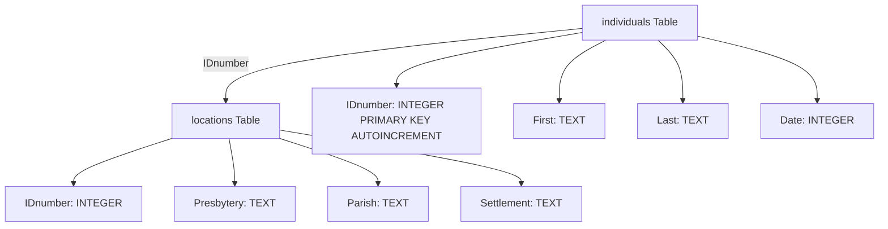

```mermaid
graph TD
    A[individuals Table] -->|IDnumber| B[locations Table]
    A --> C[IDnumber: INTEGER PRIMARY KEY AUTOINCREMENT]
    A --> D[First: TEXT]
    A --> E[Last: TEXT]
    A --> F[Date: INTEGER]
    B --> G[IDnumber: INTEGER]
    B --> H[Presbytery: TEXT]
    B --> I[Parish: TEXT]
    B --> J[Settlement: TEXT]
```
